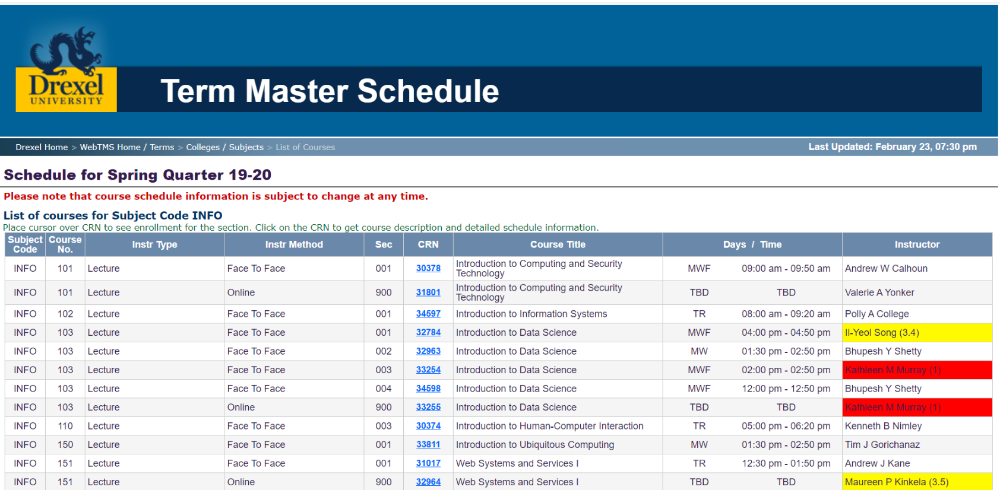
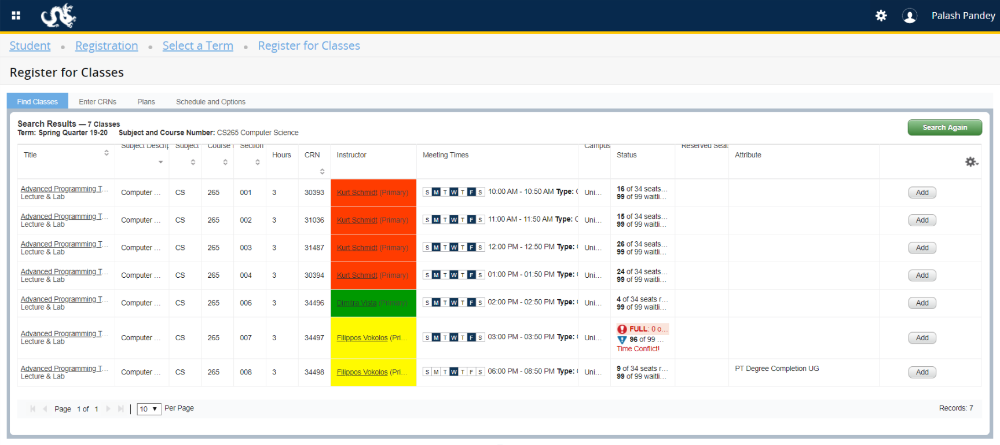

# Google chrome extension to show Drexel professor's quality metrics on Term Masters Schedule (Course List) and Banner (Registration Portal). 
# Future upgrades:
- Add professor-course combination difficulty scores 
- Publish extension to the chrome web store

### Professor's ratings are color coded from red (worst) to green (best). 

### Professor's ratings are color coded from red (worst) to green (best)